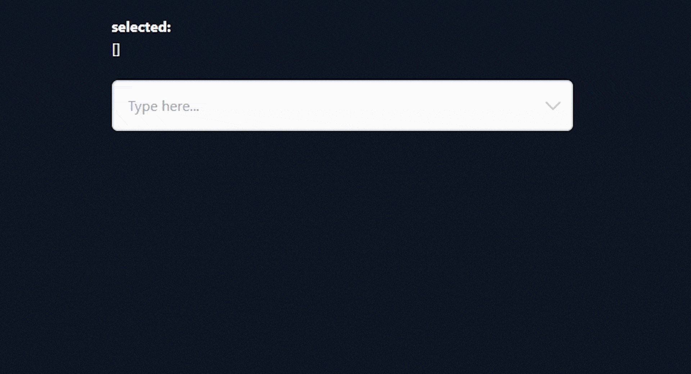
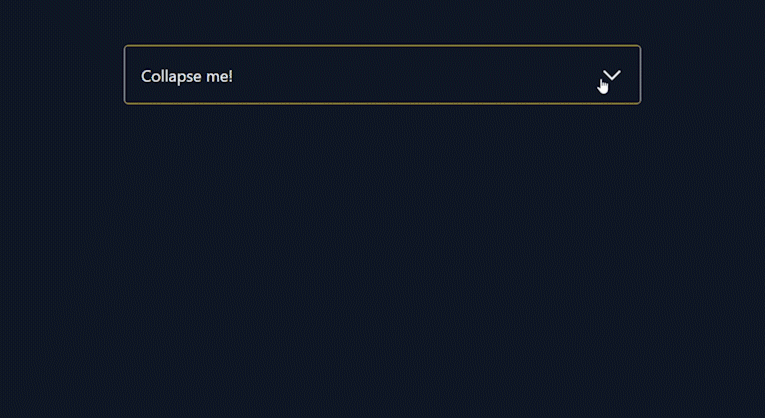

# AlpineJS + TailwindCSS Components
This will be a collection of custom components built with [alpineJS](https://alpinejs.dev/) and [tailwindCSS](https://tailwindcss.com/). 
This repository was created with the intention to create youtube tutorials and therefore each component includes a `starter` and a `final` version.

This list will be expanded gradually.

## All components

- **[Multi-Select](#multi-select)** [(watch youtube tutorial)](https://youtu.be/wQ7fN-1GrV0)
- **[Accordion](#accordion)** [(watch youtube tutorial)](https://youtu.be/JovYgM6Ebag)
- **[Modal](#modal)** [(video coming soon)]()

### Multi-Select
---

This dropdown component allows you to select multiple elements and renders selected items as tags. You can also allow duplicates. 

#### Preview

#### Options

| Property | Description | Structure | Default
| ----------- | ----------- | ----------- | ----------- |
| items | The options array should be an array of objects where each one should include a `label`, `value` and optionally a `selected` property | `items: [{ label: 'Blue', value: '#0000FF' }, { label: 'Green', value: '#00FF00' }]` | `[]`
| search | Initial value for the search-input field | `search: 'Green'` | `''` 
| searchPlaceholder | Placeholder for the search-input field | `searchPlaceholder: 'Search here...'` | `'Type here...'` 
| expanded | Defines whether the dropdown is expanded or not | `expanded: false` | `false` 
| emptyText | Defines the text for an empty message which will be visible if there are no items | `emptyText: 'Nothing found'` | `'No items found'` 
| allowDuplicates | Defines if duplicate selections are allowed | `allowDuplicates: true` | `false` 
| size | Defines how much items should be visible and therefore the dropdown size | `size: 2` | `4` 
| itemHeight | Defines the height of a dropdown element in px | `itemHeight: 100` | `40` 
| maxItemChars | Defines the maximum amount of characters of a dropdown element (creates a substring and appends three dots) | `maxItemChars: 100` | `50` 
| maxTagChars | Defines the maximum amount of characters of a tag element (creates a substring and appends three dots) | `maxItemChars: 10` | `25` 

### Accordion
---

A simple accordion component which uses the alpineJS [collapse](https://alpinejs.dev/plugins/collapse) plugin.

#### Preview

#### Options

| Property | Description | Structure | Default
| ----------- | ----------- | ----------- | ----------- |
| expanded | Defines whether the accordion is expanded or not | `expanded: false` | `false` 

### Modal
---

An easy built modal component with nice animations. 
The animations are independent from each other - one is applied to the background-overlay and another to the modal itself.

#### Preview

#### Options

| Property | Description | Structure | Default
| ----------- | ----------- | ----------- | ----------- |
| isOpen | Defines whether the modal is open or not | `isOpen: false` | `false` 

